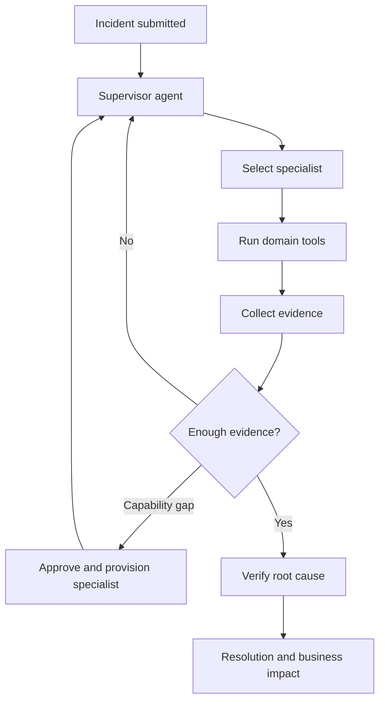
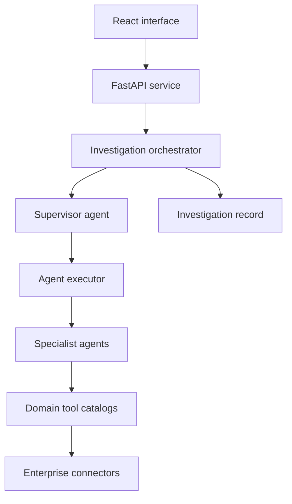

# Enterprise AI Resolution Platform

> A completed multi-agent investigation platform that autonomously analyzes enterprise operational incidents, verifies root causes, quantifies business impact, and provisions new investigative capabilities when gaps are discovered.


[](https://github.com/mayank292-ai/enterprise-ai-resolution-platform/actions/workflows/ci.yml)

## Overview

Enterprise incidents rarely stay within one system. A missing payment, delayed pipeline, schema change, or configuration issue can require several teams to collect evidence before anyone can identify the root cause.

The Enterprise AI Resolution Platform turns that manual process into a governed investigation workflow. A supervisor agent dynamically selects specialist agents, each specialist uses domain tools to gather evidence, and a verification agent checks the conclusion before the platform presents the result.

The project demonstrates the complete investigation lifecycle—from incident intake to evidence-backed resolution, business-impact analysis, replay, and capability expansion.

## Core capabilities

| Capability | Implementation |
| --- | --- |
| Dynamic orchestration | A supervisor selects the next specialist according to the evidence collected so far. |
| Domain specialists | Payment, pipeline-reliability, data-contract, and verification agents are registered as executable specialists. |
| Tool-driven reasoning | Specialists use typed tool catalogs instead of relying on a single unconstrained prompt. |
| Structured AI output | Gemini responses are validated against Pydantic schemas with repair, retry, and timeout handling. |
| Evidence verification | Findings, hypotheses, root cause, and business impact are assembled into a traceable investigation record. |
| Capability-gap handling | Missing expertise can be identified, approved, provisioned, and used to resume an investigation. |
| Investigation experience | The React interface supports intake, live progress, history, replay, analytics, knowledge, connections, and specialist views. |
| Deployment support | Docker, Cloud Build, and a manually triggered GitHub Actions deployment are included. |
| Automated testing | Backend tests cover orchestration, specialists, tools, verification, workspaces, health, and demo behavior. |

## How it works



The platform keeps reasoning, orchestration, domain tools, and external-system connectors separate. The included connectors provide deterministic enterprise scenarios for demonstrating the complete workflow and can be replaced with production integrations.

## Example investigation

An operations user reports that several high-value cross-border payments are missing from the settlement dashboard.

The platform can:

1. Create an investigation and classify the incident.
2. Ask the payment specialist to inspect transaction evidence.
3. Route pipeline or schema findings to the relevant specialist.
4. Form and test hypotheses using additional tool calls.
5. Provision a missing capability after approval when necessary.
6. Verify the root cause and calculate business impact.
7. Present a completed report with an evidence trail and replayable timeline.

## Application experience

The frontend includes:

- Command center and investigation intake
- Live agent timeline and evidence cards
- Root-cause and business-impact presentation
- Investigation archive, historical reports, and replay
- Specialist and capability registry
- Knowledge, connections, analytics, and governance views
- A demo fallback for presentation reliability

The FastAPI backend exposes workspace and investigation APIs, including endpoints to create, run, retrieve, resume, and demonstrate investigations.

## Architecture



## Repository structure

```text
enterprise-ai-resolution-platform/
├── .github/workflows/     # Continuous integration and optional deployment
├── backend/
│   ├── app/
│   │   ├── agents/       # Supervisor and specialist implementations
│   │   ├── api/          # Investigation and workspace endpoints
│   │   ├── connectors/   # Replaceable enterprise data connectors
│   │   ├── models/       # Validated investigation domain models
│   │   ├── services/     # Orchestration and capability provisioning
│   │   └── tools/        # Typed domain tool catalogs
│   ├── scripts/
│   └── tests/
├── frontend/
│   └── src/              # React application, pages, components, and API hooks
├── cloudbuild.yaml       # Container build and Cloud Run deployment pipeline
└── README.md
```

## Technology stack

| Layer | Technologies |
| --- | --- |
| AI and orchestration | Gemini on Vertex AI, structured agent responses, dynamic specialist routing |
| Backend | Python, FastAPI, Pydantic, Google Gen AI SDK |
| Frontend | React, TypeScript, Vite, Tailwind CSS, TanStack Query, Motion |
| Testing | Pytest, HTTPX, pytest-asyncio |
| Deployment | Docker, Google Cloud Build, GitHub Actions, Cloud Run |

## Run locally

### Prerequisites

- Python 3.10 or newer
- Node.js and npm
- A Google Cloud project with Vertex AI access
- Application Default Credentials configured for that project

### Backend

```bash
cd backend
python -m venv .venv
source .venv/bin/activate
pip install -r requirements.txt

export GOOGLE_CLOUD_PROJECT="your-project-id"
export GOOGLE_CLOUD_LOCATION="us-central1"
export GEMINI_MODEL="your-supported-gemini-model"

python -m uvicorn app.main:app --reload
```

The API is available at `http://localhost:8000`, with interactive documentation at `http://localhost:8000/docs`.

### Frontend

```bash
cd frontend
cp .env.example .env
npm install
npm run dev
```

The frontend is available at `http://localhost:5173` and connects to the backend URL defined by `VITE_API_BASE_URL`.

### Tests

```bash
cd backend
pytest
```

```bash
cd frontend
npm run lint
npm run build
```

The same backend and frontend checks run automatically for every push and pull request through GitHub Actions.

## Optional Cloud Run deployment

The manual deployment workflow builds both containers, deploys them through Google Cloud Build, and performs backend, frontend, and CORS smoke tests. Configure these GitHub repository variables before running it:

- `GCP_PROJECT_ID`
- `GCP_REGION`
- `GCP_WORKLOAD_IDENTITY_PROVIDER`
- `GCP_DEPLOY_SERVICE_ACCOUNT`
- `GCP_RUNTIME_SERVICE_ACCOUNT`
- `FRONTEND_ORIGIN`
- `GEMINI_MODEL`

## Design principles

- **Evidence before conclusions:** Agent decisions are grounded in tool results and retained in the investigation record.
- **Specialization over one large prompt:** Each agent owns a focused domain and a bounded set of tools.
- **Governed expansion:** New capabilities require explicit approval before they are provisioned.
- **Replaceable integrations:** Connectors isolate external systems from reasoning and orchestration.
- **Structured reliability:** AI responses are schema-validated and retried when malformed or transiently unavailable.

## Hackathon theme

> **Resolve once. Learn permanently.**

The completed build demonstrates how an investigation that traditionally requires hours of coordination can be compressed into a guided, evidence-backed workflow while turning each resolution into reusable organizational knowledge.
